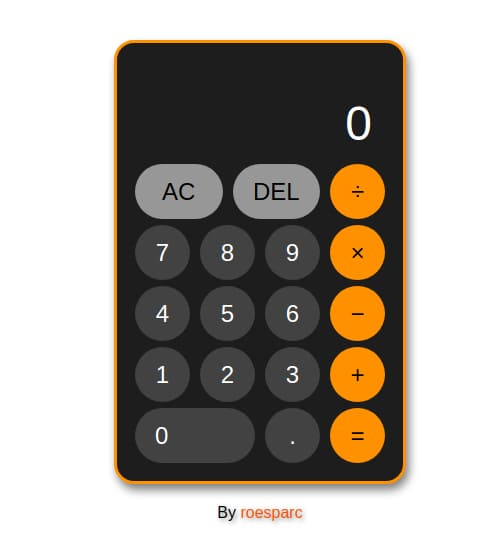

# Calculator

## [Live Demo](https://roesparc.github.io/Calculator/)

Calculator created with HTML, CSS and JS.

### Features

- Keyboard support
- String together several operations
- Backspace and AC buttons
- Can't use decimal point more than once
- Displays "error" when trying to devide by zero
